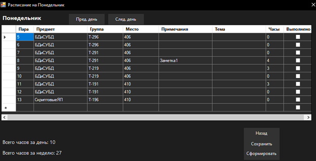

# 📚 Teacher's Daily Planner

> **A comprehensive desktop application for automating teacher workflow and schedule management**

   

## 🎯 Overview

**Teacher's Daily Planner** is a desktop application designed to streamline and automate the daily workflow of educators. The application provides comprehensive tools for schedule management, lesson tracking, and academic reporting, making it easier for teachers to organize their educational activities efficiently.

### ✨ Key Features

- 🔐 **Secure Authentication** - User login system with role-based access

- 📅 **Schedule Management** - Weekly and daily schedule viewing with filtering options

- 🌐 **Web Scraping Integration** - Automatic schedule parsing from college website

- 📝 **Lesson Notes** - Add and manage notes for individual classes

- 📊 **Progress Tracking** - Calculate conducted hours per day/week by subject or group

- 🧪 **Lab Work Management** - Track laboratory sessions and assignments

- 📈 **Reporting System** - Generate detailed reports on teaching activities

- 📤 **Export Functionality** - Export reports to MS Office formats

## 🛠️ Technology Stack

- **Language:** C#

- **Framework:** .NET Framework

- **UI:** Windows Forms (WinForms)

- **Database:** SQL Server Management Studio (SSMS)

- **Architecture:** Desktop Application

## 📋 Core Functionality

### 🔑 Authentication System

- Secure login with username and password

- Role-based access control for different user types

- Data encryption for database operations

### 📅 Schedule Management

- **Weekly View:** Complete overview of the week's schedule

- **Daily View:** Detailed daily schedule with time slots

- **Filtering:** Filter by subject or student group

- **Real-time Updates:** Automatic parsing from college website

### 📊 Academic Tracking

- **Hour Calculation:** Automatic calculation of conducted vs. planned hours

- **Lab Work Tracking:** Monitor laboratory sessions and completion status

- **Progress Reports:** Generate comprehensive academic reports

- **Note Management:** Add contextual notes to individual lessons

### 📈 Reporting & Analytics

- **Performance Metrics:** Track teaching efficiency and coverage

- **Export Options:** Generate reports in MS Office formats

- **Statistical Analysis:** Analyze teaching patterns and workload distribution

## 🏗️ System Architecture

The application follows a layered architecture pattern:

- **Presentation Layer:** Windows Forms UI

- **Business Logic Layer:** Core application logic and calculations

- **Data Access Layer:** Database operations and web scraping

- **Database Layer:** SQL Server for data persistence

### 📊 Database Schema

Key entities include:

- **Teacher:** User authentication and profile data

- **Lesson:** Individual class sessions with metadata

- **Group:** Student group information

- **Subject:** Course/subject details

- **LabWork:** Laboratory session tracking

- **LessonNote:** Contextual notes for lessons

## 🎨 User Interface

The application features an intuitive interface designed to mirror traditional paper-based planners:

- **Schedule Grid:** Visual representation of weekly/daily schedules

- **Navigation Panel:** Easy access to different application sections

- **Data Entry Forms:** Streamlined forms for lesson tracking and notes

- **Report Dashboard:** Comprehensive reporting interface

## 🔧 System Requirements

- **OS:** Windows 10/11

- **Processor:** Multi-core processor (4+ threads recommended)

- **Memory:** 4 GB RAM minimum

- **Graphics:** DirectX 9 compatible

- **Storage:** Sufficient space for database and reports

- **Network:** Internet connection required for schedule parsing

## 📸 Screenshots

Here are some screenshots illustrating the application in action:

| Screenshot | Description |
|---|---|
|  | **Login Form:** Authentication form with filled fields. |
|  | **Schedule Form:** Displays the teacher's weekly schedule. |
|  | **Filtered Schedule:** Schedule form after filtering by subject (e.g., "БДиСУБД"). |
|  | **Note Input:** Schedule form for a selected day with filled input fields for notes. |
|  | **Hours Calculation:** Form for calculating total hours after data entry and clicking "Calculate". |
|  | **Admin Panel:** Administrator panel for managing users and data. |
|  | **Add New User:** Form for adding a new user to the system. |
|  | **Edit User:** Form for editing an existing user's details. |

## 🙏 Acknowledgments

- College of Business and Law for providing the educational context

- Microsoft for the .NET Framework and development tools

- The open-source community for inspiration and best practices

**⭐ If you found this project helpful, please consider giving it a star!**
